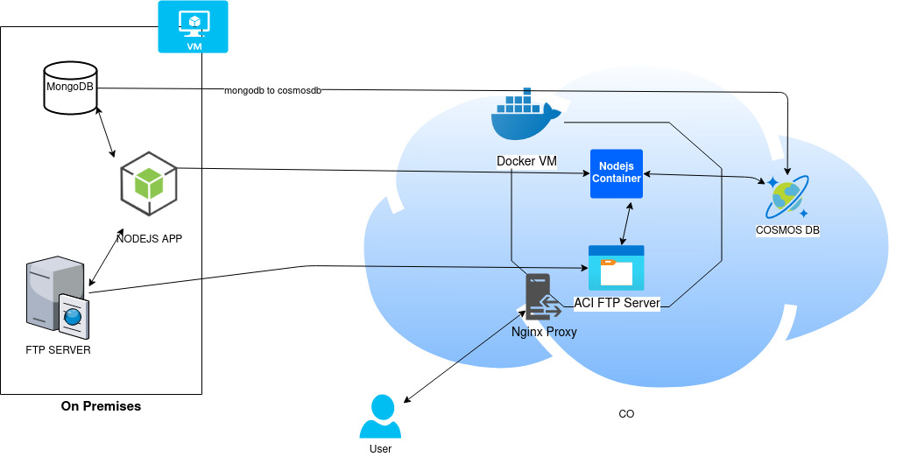

# Application-assig

## Introduction

This "result" was published solely for me not to sent an empty email of an empty repo. I wasn't aware that that was a senior cloud engineer position. Unfortunately I' am but a junior-mid network engineer that has very basic coding experience, mostly in python, and non existent cloud or iac or even architectural design experience. 
Nevertheless I hope you enjoy my 3 day effort to learn azure cloud engineering and coding!!! ;) :D

## Methodology

### NodeJS

Initialy we will create an on demand SFTP Azure Container Instance (ACI). It creates a sStorage Account and a FIle Share via azure CLI. The file share is then mounted into the main Linux ACI to provide persistent storage ater the container is terminated. Later we will deploy a simulation infrastructure for on-premises two-tier Nodejs application and MongoDb on a single Ububtu server virtual machine.
Once deployment finishes, you can connect to deployed VM and verify the Mongo database as well as Nodejs application and test application by launching the same in browser. Finaly we run a reverse proxy NGINX in front of the Docker containers for more access control.

### Cron Server

For this instance we will use Azure Schedule Automation and we will create a Python runbook that we will associate with the Schedule. For the bash script we will
create and store it in a storage account or Github.Then we will write a RunBook which executes the bash script on Linux VM using Custom Script extension. Finaly we will associate the playbook with the Schedule.

### ElastiSearch and Kibana

Azure tracks all the events in our Azure Account/Subscription and publishes it to Azure Activity Log service. We will take those logs and stream them to Elastic Search service and then use Kibana to visualize the logs. Ufortunately I couldnt find our  how to make the VN private.

